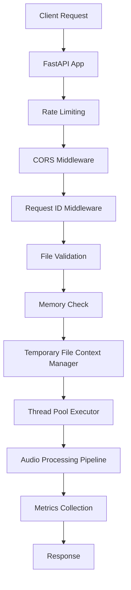

# main.py - Audio Transcription API Documentation

## Overview

The `main.py` file is the core FastAPI application for the Guitar Music Helper audio transcription service. It provides a production-ready REST API that transcribes guitar audio files into structured chord and melody data using the basic-pitch machine learning model.

## Architecture Overview



## Core Components

### 1. Configuration Management

**Class**: `Config` (BaseSettings)
**Purpose**: Centralized configuration management with environment variable support

```python
class Config(BaseSettings):
    MAX_FILE_SIZE_MB: int = 10
    ALLOWED_EXTENSIONS: set[str] = {'.wav', '.mp3', '.m4a', '.flac', '.ogg'}
    MAX_WORKERS: int = 1
    ENVIRONMENT: str = "development"
    LOG_LEVEL: str = "INFO"
    PROCESSING_TIMEOUT: int = 45
    CORS_ORIGINS: list[str] = [...]
    CORS_ORIGIN_REGEX: str | None = r"^https://..."
```

**Environment Variables**:
- `RAILWAY_ENVIRONMENT`: Sets the deployment environment
- `MAX_FILE_SIZE_MB`: Maximum upload size (1-100 MB)
- `PROCESSING_TIMEOUT`: Maximum processing time (10-300 seconds)

### 2. Memory Management System

**Functions**:
- `get_memory_usage()`: Returns current process memory in MB
- `check_memory_availability(estimated_mb)`: Checks if sufficient memory is available

**Features**:
- Uses `psutil` for accurate memory monitoring
- 50% safety buffer for memory calculations
- Graceful degradation when psutil unavailable

### 3. Metrics Collection

**Class**: `SimpleMetrics`
**Purpose**: In-memory metrics collection for API monitoring

**Capabilities**:
- Request counting by endpoint
- Error tracking by type and endpoint
- Processing time recording (last 100 entries)
- Current memory usage reporting

**Methods**:
```python
metrics.record_request(endpoint_name)
metrics.record_error(endpoint_name, error_type)
metrics.record_processing_time(endpoint_name, duration)
stats = metrics.get_stats()
```

### 4. File Management

**Context Manager**: `temporary_audio_file(file: UploadFile)`
**Purpose**: Automatic temporary file lifecycle management

**Features**:
- Chunked streaming (1MB chunks) for memory efficiency
- Automatic cleanup on success or failure
- Preserves original file extension
- Async context manager pattern

### 5. Audio Processing Pipeline

**Main Function**: `process_audio_file_sync(tmp_path: str) -> ProcessingResult`
**Helper Functions**:
- `load_audio_file()`: Memory-efficient audio loading with librosa
- `run_basic_pitch_prediction()`: Basic-pitch ML model inference

**Pipeline Steps**:
1. File size logging and garbage collection
2. Audio loading (22050 Hz, mono, limited duration)
3. Memory cleanup of audio data
4. Basic-pitch prediction
5. Processing output with local utilities
6. Result formatting and cleanup

## API Endpoints

### Core Endpoints

#### `POST /transcribe`
**Purpose**: Main audio transcription endpoint
**Rate Limit**: 5 requests/minute
**Dependencies**: 
- `check_dependencies()`: Ensures ML libraries loaded
- `validate_file()`: File validation
- `get_metrics_collector()`: Metrics injection

**Process Flow**:
1. Memory availability check (4x file size estimate)
2. 80% memory threshold warning
3. Temporary file creation with context manager
4. Thread pool execution with timeout
5. Response construction with Pydantic models

#### `POST /transcribe-status`
**Purpose**: Pre-flight check for transcription feasibility
**Rate Limit**: 10 requests/minute
**Returns**: Memory analysis and processing feasibility

### Health Check Endpoints

#### `GET /health`
**Purpose**: Basic service health status
**Returns**: Dependencies, supported formats, configuration

#### `GET /health/detailed`
**Purpose**: Comprehensive system health check
**Returns**: Memory usage, disk space, system resources

#### `GET /metrics`
**Purpose**: API usage statistics
**Returns**: Request counts, error rates, processing times, memory usage

### Diagnostic Endpoints (Development Only)

#### `POST /test-minimal-processing`
**Purpose**: Step-by-step processing diagnostics
**Steps**: File upload → librosa loading → basic-pitch prediction

#### `POST /test-dependencies`
**Purpose**: ML dependency availability testing

#### `POST /test-upload`
**Purpose**: File upload testing without processing

## Error Handling System

### Exception Hierarchy

```python
Exception
├── HTTPException (FastAPI built-in)
├── AudioProcessingError (Custom)
└── DependencyError (Custom)
```

### Exception Handlers

All handlers include:
- Request ID tracking
- Structured JSON responses
- Consistent error codes
- Detailed logging

**Error Codes**:
- `INTERNAL_SERVER_ERROR` (500): Unexpected errors
- `REQUEST_ERROR` (4xx): Client-side errors
- `AUDIO_PROCESSING_ERROR` (422): Processing failures
- `SERVICE_UNAVAILABLE` (503): Missing dependencies

## Security Features

### CORS Configuration
- Environment-specific origins
- Vercel deployment regex support
- Credential support with specific origins
- Method and header restrictions

### Rate Limiting
- IP-based rate limiting with `slowapi`
- Endpoint-specific limits
- Automatic error responses

### File Validation
- Size limits (configurable, default 10MB)
- Extension whitelist
- MIME type validation with common variations
- Empty file detection

## Memory Optimization

### Railway Deployment Considerations
- Single worker configuration (avoid memory multiplication)
- Conservative memory estimates (4x file size)
- Proactive memory checking before processing
- Garbage collection at critical points
- Chunked file streaming

### Memory Monitoring
- Real-time memory usage tracking
- 80% threshold warnings
- 507 Insufficient Storage responses
- Memory info in health checks

## Dependency Management

### ML Dependencies (Optional)
```python
try:
    import librosa
    import numpy as np
    from basic_pitch.inference import predict
    DEPENDENCIES_LOADED = True
except ImportError:
    DEPENDENCIES_LOADED = False
```

### Local Dependencies (Optional)
```python
try:
    from models import TranscriptionResponse, TranscriptionResult
    from transcription_utils import process_basic_pitch_output
    MODELS_LOADED = True
except ImportError:
    MODELS_LOADED = False
```

## Development Guidelines

### Adding New Endpoints

1. **Add rate limiting**: Use `@limiter.limit("X/minute")`
2. **Use dependency injection**: Inject metrics, file validation, etc.
3. **Include error handling**: Record errors in metrics
4. **Add request ID**: Use `getattr(request.state, 'request_id', None)`
5. **Update rate limits endpoint**: Document new endpoint limits

### Memory Considerations

1. **Estimate memory usage**: Use 4x file size as baseline
2. **Check availability**: Use `check_memory_availability()`
3. **Add cleanup**: Use context managers or explicit cleanup
4. **Monitor usage**: Include memory tracking in processing

### Testing Strategy

1. **Unit tests**: Test individual functions in isolation
2. **Integration tests**: Test full endpoint workflows
3. **Memory tests**: Test with various file sizes
4. **Error tests**: Test all exception paths
5. **Load tests**: Test rate limiting and concurrent requests

### Monitoring and Observability

1. **Metrics**: Use injected metrics collector
2. **Logging**: Include request IDs and relevant context
3. **Health checks**: Monitor dependencies and resources
4. **Error tracking**: Categorize errors by type and endpoint

## Production Deployment

### Environment Setup
```env
RAILWAY_ENVIRONMENT=production
LOG_LEVEL=WARNING
MAX_FILE_SIZE_MB=10
PROCESSING_TIMEOUT=60
```

### Gunicorn Configuration (Procfile)
```
web: gunicorn main:app -w 1 -k uvicorn.workers.UvicornWorker --bind 0.0.0.0:$PORT
```

### Docker Health Check
```dockerfile
HEALTHCHECK --interval=30s --timeout=3s --start-period=5s --retries=3 \
  CMD curl -f http://localhost:8000/health || exit 1
```

## Troubleshooting

### Common Issues

1. **Memory exhaustion**: Check file sizes, reduce MAX_FILE_SIZE_MB
2. **Processing timeouts**: Increase PROCESSING_TIMEOUT
3. **CORS errors**: Verify CORS_ORIGINS configuration
4. **Rate limit exceeded**: Check `/rate-limits` endpoint for limits
5. **Dependencies not loaded**: Check logs for import errors

### Debug Endpoints

- `GET /debug`: System information and dependency status
- `GET /health/detailed`: Comprehensive system health
- `POST /test-dependencies`: ML library availability
- `POST /test-minimal-processing`: Step-by-step diagnostics

### Monitoring Queries

```bash
# Check health
curl https://your-api.railway.app/health/detailed

# Check metrics
curl https://your-api.railway.app/metrics

# Check rate limits
curl https://your-api.railway.app/rate-limits
```

## Code Quality Standards

### Type Safety
- TypedDict for structured data (`ProcessingResult`)
- TYPE_CHECKING for optional imports
- Proper type hints for all functions

### Error Handling
- Custom exception types
- Comprehensive exception handlers
- Request ID tracking
- Structured error responses

### Resource Management
- Context managers for file handling
- Explicit memory cleanup
- Thread pool lifecycle management
- Graceful degradation patterns

### Documentation
- Comprehensive docstrings
- API endpoint documentation
- Configuration documentation
- Error code documentation

## Future Enhancements

### Suggested Improvements
1. **Modular architecture**: Split into separate modules
2. **Response caching**: Cache results for identical files
3. **Async processing**: Queue system for large files
4. **Enhanced monitoring**: Prometheus/Grafana integration
5. **Structured logging**: JSON logging with loguru

### Scaling Considerations
1. **Horizontal scaling**: Multiple instances with load balancer
2. **External caching**: Redis for response caching
3. **Message queues**: Celery for background processing
4. **Database integration**: Persistent metrics and results storage

This documentation should serve as a comprehensive guide for any developer working with or maintaining this production-grade audio transcription API.
