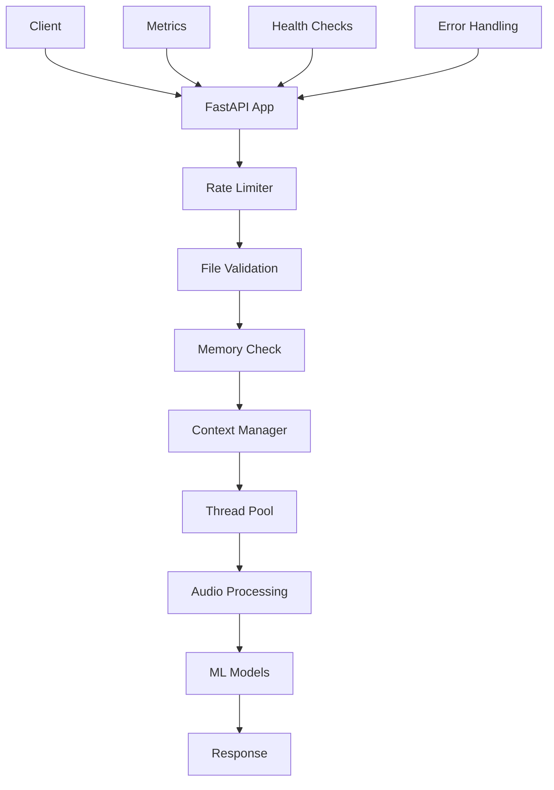

# Guitar Music Helper - Audio Transcription API

> 🎸 Production-ready FastAPI service for transcribing guitar audio into structured musical data using machine learning

[](https://python.org)
[](https://fastapi.tiangolo.com)
[](https://railway.app)

## ✨ Features

- **🎵 Audio Transcription**: Convert guitar audio to chords, melody, and tempo
- **🚀 Production Ready**: Enterprise-grade error handling, monitoring, and resource management  
- **💾 Memory Optimized**: Efficient processing for Railway's memory constraints
- **📊 Built-in Monitoring**: Request metrics, health checks, and system monitoring
- **🔒 Rate Limited**: IP-based rate limiting to prevent abuse
- **🌐 CORS Enabled**: Full CORS support for web applications
- **📱 Developer Friendly**: Comprehensive API documentation and diagnostic tools

## 🏗️ Architecture



## 🚀 Quick Start

### Prerequisites

- Python 3.8+
- 2GB+ RAM recommended
- Audio files in supported formats (MP3, WAV, M4A, FLAC, OGG)

### Installation

```bash
# Clone the repository
git clone https://github.com/dberzon/guitar-music-helper.git
cd guitar-music-helper/guitar-music-helper-backend

# Create virtual environment
python -m venv venv
source venv/bin/activate  # or `venv\Scripts\activate` on Windows

# Install dependencies
pip install -r requirements.txt

# Start development server
python main.py
```

### Basic Usage

```bash
# Check API health
curl http://localhost:8000/health

# Transcribe an audio file
curl -X POST "http://localhost:8000/transcribe" \
  -F "file=@guitar_sample.mp3"

# Check processing feasibility first
curl -X POST "http://localhost:8000/transcribe-status" \
  -F "file=@large_audio.mp3"
```

## 📖 Documentation

| Document | Description |
|----------|-------------|
| **[API Reference](API_REFERENCE.md)** | Complete API documentation with examples |
| **[Developer Onboarding](DEVELOPER_ONBOARDING.md)** | Quick start guide for new developers |
| **[Technical Documentation](MAIN_PY_DOCUMENTATION.md)** | In-depth technical architecture guide |

## 🎯 API Endpoints

### Core Endpoints

| Endpoint | Method | Rate Limit | Description |
|----------|--------|------------|-------------|
| `/transcribe` | POST | 5/min | Transcribe audio to musical data |
| `/transcribe-status` | POST | 10/min | Check if file can be processed |
| `/health` | GET | - | Basic health check |
| `/health/detailed` | GET | - | Comprehensive system health |
| `/metrics` | GET | - | API usage statistics |

### Example Response

```json
{
  "success": true,
  "data": {
    "metadata": {
      "filename": "guitar.mp3",
      "duration": 30.5,
      "sampleRate": 22050,
      "processingTime": 8.2
    },
    "chords": [
      {"start": 0.0, "end": 2.5, "chord": "C", "confidence": 0.85},
      {"start": 2.5, "end": 5.0, "chord": "G", "confidence": 0.78}
    ],
    "melody": [
      {"start": 0.1, "end": 0.3, "pitch": 261.63, "note": "C4", "confidence": 0.92}
    ],
    "tempo": 120.0
  },
  "processingTime": 8.2
}
```

## ⚙️ Configuration

### Environment Variables

```env
# Core settings
RAILWAY_ENVIRONMENT=production
MAX_FILE_SIZE_MB=10
PROCESSING_TIMEOUT=45

# Logging
LOG_LEVEL=INFO

# CORS (comma-separated)
CORS_ORIGINS=["http://localhost:3000","https://myapp.com"]
```

### Supported File Formats

| Format | Extensions | Max Size | Notes |
|--------|------------|----------|-------|
| Audio | `.mp3`, `.wav`, `.m4a`, `.flac`, `.ogg` | 10MB | Mono recommended |

## 🔧 Production Features

### Memory Management
- **Proactive monitoring**: Checks available memory before processing
- **Smart cleanup**: Context managers for automatic resource cleanup
- **Railway optimized**: Single worker configuration for memory efficiency
- **Garbage collection**: Explicit cleanup at critical points

### Error Handling
- **Request tracing**: Unique IDs for debugging
- **Structured responses**: Consistent error format across all endpoints
- **Graceful degradation**: Service continues even if ML dependencies fail
- **Comprehensive logging**: Full context for troubleshooting

### Monitoring & Observability
- **Built-in metrics**: Request counts, error rates, processing times
- **Health checks**: System resources, dependencies, disk space
- **Memory tracking**: Real-time memory usage monitoring
- **Performance insights**: Average processing times and bottlenecks

## 🚀 Deployment

### Railway (Recommended)

The app is optimized for Railway deployment:

```bash
# Deploy to Railway
railway up

# Check deployment health
curl https://your-app.railway.app/health
```

**Production Configuration** (Procfile):
```
web: gunicorn main:app -w 1 -k uvicorn.workers.UvicornWorker --bind 0.0.0.0:$PORT
```

### Docker

```dockerfile
FROM python:3.9-slim

WORKDIR /app
COPY requirements.txt .
RUN pip install -r requirements.txt

COPY . .

# Health check
HEALTHCHECK --interval=30s --timeout=3s --start-period=5s --retries=3 \
  CMD curl -f http://localhost:8000/health || exit 1

CMD ["python", "main.py"]
```

## 🧪 Testing

### Development Endpoints

The API includes diagnostic endpoints for testing:

```bash
# Test file upload without processing
curl -X POST "http://localhost:8000/test-upload" -F "file=@test.mp3"

# Test ML dependencies
curl -X POST "http://localhost:8000/test-dependencies"

# Step-by-step processing diagnostics
curl -X POST "http://localhost:8000/test-minimal-processing" -F "file=@test.mp3"
```

### Load Testing

```bash
# Check rate limits
curl http://localhost:8000/rate-limits

# Monitor metrics during testing
watch -n 5 'curl -s http://localhost:8000/metrics | jq'
```

## 🛠️ Development

### Project Structure

```
guitar-music-helper-backend/
├── main.py                    # Main FastAPI application
├── models.py                  # Pydantic response models  
├── transcription_utils.py     # Audio processing utilities
├── requirements.txt           # Dependencies
├── Procfile                   # Railway deployment config
├── API_REFERENCE.md           # Complete API documentation
├── DEVELOPER_ONBOARDING.md    # Developer quick start
└── MAIN_PY_DOCUMENTATION.md   # Technical architecture docs
```

### Adding Features

1. **New Endpoint**: Follow dependency injection patterns
2. **Error Handling**: Use custom exception types with request tracing
3. **Metrics**: Record requests, errors, and processing times
4. **Memory**: Check availability and implement cleanup
5. **Documentation**: Update API reference and rate limits

### Code Quality

- **Type Safety**: Full type hints with TypedDict for structured data
- **Error Handling**: Custom exceptions with comprehensive handlers
- **Resource Management**: Context managers and explicit cleanup
- **Documentation**: Comprehensive docstrings and API docs

## 📊 Performance

### Benchmarks (Railway Hobby Plan)
- **Small files (≤1MB)**: ~3-8 seconds processing time
- **Medium files (1-3MB)**: ~8-15 seconds processing time  
- **Large files (3-10MB)**: ~15-30 seconds processing time
- **Memory usage**: ~150-400MB depending on file size
- **Concurrent requests**: Limited by memory constraints

### Optimization Tips
1. **Use mono audio**: Reduces processing time and memory
2. **Compress files**: Smaller files process faster
3. **Check status first**: Use `/transcribe-status` for large files
4. **Monitor metrics**: Track performance with `/metrics` endpoint

## 🤝 Contributing

### Development Setup

```bash
# Install development dependencies
pip install -e .
pip install pytest black isort mypy

# Run tests
pytest

# Format code
black .
isort .

# Type checking
mypy main.py
```

### Contribution Guidelines

1. **Follow existing patterns**: Use dependency injection and error handling patterns
2. **Add tests**: Include unit tests for new functionality
3. **Update docs**: Update API documentation for new endpoints
4. **Memory conscious**: Consider memory usage in Railway environment
5. **Error handling**: Include comprehensive error handling with metrics

## 📝 License

This project is licensed under the MIT License - see the [LICENSE](LICENSE) file for details.

## 🆘 Support

### Troubleshooting

| Issue | Solution |
|-------|----------|
| "Dependencies not loaded" | Check `/test-dependencies` endpoint |
| "File too large" | Use files ≤10MB or check `/transcribe-status` |
| "Memory errors" | Try smaller files or wait for memory to free up |
| "Rate limited" | Check `/rate-limits` for current limits |
| "CORS errors" | Verify `CORS_ORIGINS` configuration |

### Getting Help

1. **Check diagnostics**: Use `/debug` and `/health/detailed` endpoints
2. **Review logs**: Look for request IDs in error responses
3. **API documentation**: See [API_REFERENCE.md](API_REFERENCE.md) for complete docs
4. **Developer guide**: See [DEVELOPER_ONBOARDING.md](DEVELOPER_ONBOARDING.md) for setup help

### Monitoring

```bash
# Real-time health monitoring
watch -n 10 'curl -s https://your-api.railway.app/health/detailed | jq .status'

# Performance monitoring  
curl -s https://your-api.railway.app/metrics | jq .avg_processing_time_seconds
```

---

**Built with ❤️ for musicians and developers**

This production-ready API transforms guitar audio into structured musical data, making it easy to build music applications, educational tools, and creative projects.
